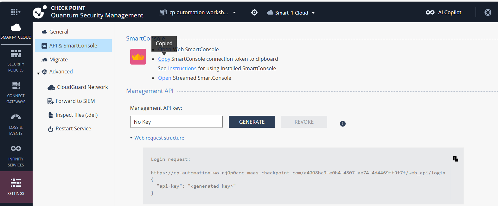
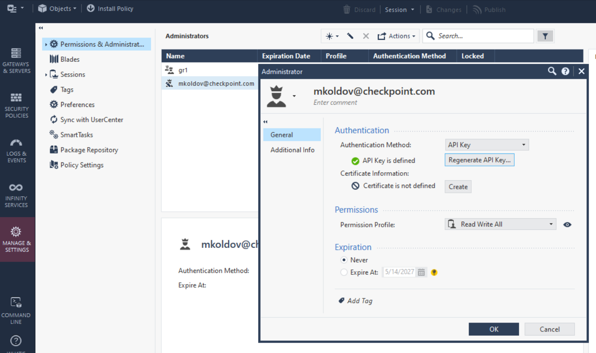
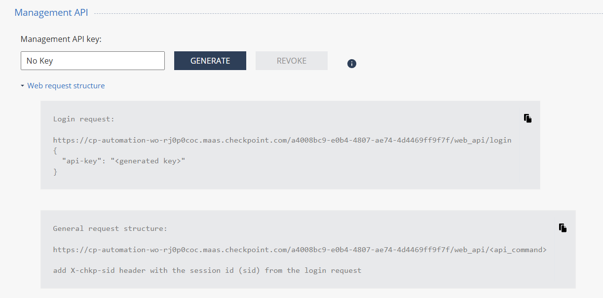
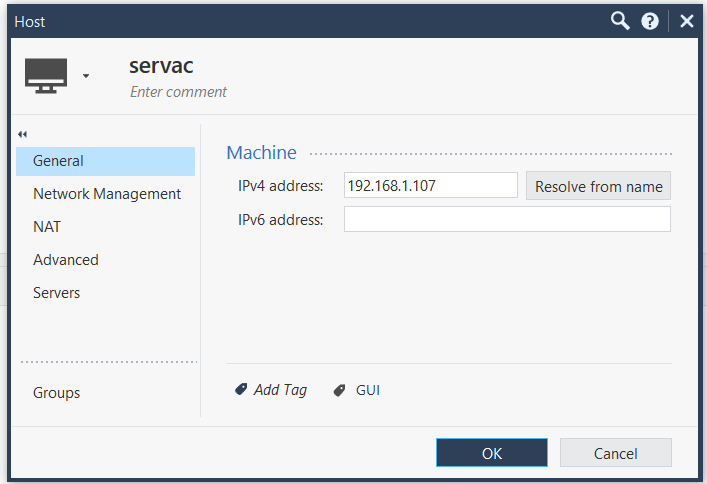

# Basic CP Policy

Goal: Demonsrate how to get Smart-1 Cloud service and work with basic CP policy from Terraform.

## Prerequisites
- Smart-1 Cloud demo tenant
- [this](https://github.com/mkol5222/cp-automation-workshops-2025) Codespace environment

## Smart-1 Cloud demo tenant
- Register new [Infinity Portal](https://portal.checkpoint.com/register) account for your username/e-mail
- Create a new [Smart-1 Cloud](https://portal.checkpoint.com/dashboard/security-management#/welcome) service by choosing the "Start a demo" option
- Navigate to Smart-1 Cloud service [Settings](https://portal.checkpoint.com/dashboard/security-management#/mgmt/) and choose "API & SmartConsole" section
- Open installed SmartConsole and login using connection token copied to clipboard



Summary: we have create a new Smart-1 Cloud service and connected to it using SmartConsole. We are ready to provide dedicated credentials for automation.

## Automation credentials

Automation account is eaqual to interactive SmartConsole users when it comes to credentials and permissions. It is best practice to create a dedicated user for automation purposes. We will use `Read Write All` permission profile for this user and will authenticate using `API key` method. One has just one credential - API key - instead of suing username and password, but management server will still know the username of user who owns the API key. This is important for auditing purposes and for parallel devops and clickops operations.

- Open SmartConsole and navigate to `Manage > Permissions & Administrators > Administrators`
- This is where you would add a new user, but we will use the existing one due to demo tenant limitation. Select your user and click `Edit`
- In the `General` tab, select `API Key` as authentication method and click `Generate API Key`
- Copy the API key to clipboard and save it in a safe place. You will not be able to see it again.
- In the `Permissions` tab, you would select `Read Write All` permission profile and click `OK`
- API key is active only once we Install database. Choose `Install database..." option in SmartConsole top left corner menu.



We have to collect Smart-1 cloud hostname and cloud ID from Infiniti Portal settings section. This is needed to connect to the management server using Terraform and other API clinets. We will also need the API key we just created.

Look at API instructions in the Smart-1 Cloud settings section. 



- in case of URL `https://cp-automation-wo-rj0p0coc.maas.checkpoint.com/a4008bc9-e0b4-4807-ae74-4d4469ff9f7f/web_api/login`:
  - hostname: `cp-automation-wo-rj0p0coc.maas.checkpoint.com`
  - cloud_id: `a4008bc9-e0b4-4807-ae74-4d4469ff9f7f`

We can try our first API call using curl command:
```bash
export CHECKPOINT_SERVER=cp-automation-wo-rj0p0coc.maas.checkpoint.com
export CHECKPOINT_CLOUD_MGMT_ID=a4008bc9-e0b4-4807-ae74-4d4469ff9f7f
export CHECKPOINT_API_KEY=your_api_key

export PAYLOAD=$(jq -n --arg api_key "${CHECKPOINT_API_KEY}" '{"api-key": $api_key}')

RESPONSE=$(curl -s -X POST "https://${CHECKPOINT_SERVER}/${CHECKPOINT_CLOUD_MGMT_ID}/web_api/login" \
  -H "Content-Type: application/json" \
  -d "$PAYLOAD")
echo $RESPONSE | jq .
```

Assume we want to use obtained token `sid` in the next API calls. We can use `jq` to extract it from the response:
```bash

export SID=$(echo $RESPONSE | jq -r '.sid')
echo $SID

# latest API reference https://sc1.checkpoint.com/documents/latest/APIs/

PAYLOAD=$(jq -n '{"details-level": "full", name: "Network"}')

RESPONSE=$(curl -s -X POST "https://${CHECKPOINT_SERVER}/${CHECKPOINT_CLOUD_MGMT_ID}/web_api/show-access-rulebase" \
  -H "Content-Type: application/json" \
  -H "X-chkp-sid: ${SID}" \
  -d "$PAYLOAD")
echo $RESPONSE | jq .
```

Summary: we know how to get automation credenttials and how to use them to talk to management server using raw API in shell environment using bash, curl and jq.
CURL login call is quick way to validate management server connectivity and API key.


## API playground with VS Code REST Client extension

VS Code [REST Client extension](https://marketplace.visualstudio.com/items?itemName=humao.rest-client) is a great tool to test API calls. You can use it to test API calls without writing specific programming or scripting language any code. Just create a new file with `.http` extension and write your API calls in it. You can use variables in the file and they will be replaced with their values when you run the request.

This brings true **HTTP Request as Code** concept to the table. You can use it to document your API calls and share them with your team. You can also use it to test your API calls before you implement them in your code. 

Also `Copy Request as CURL` option in the extension is a great way to get started with your API calls. You can use it to generate a curl command from your API call and then use it in your code.

More in `01-cp-policy-basic/http/cpman.http` file.

## Terraform provider for Check Point Security Management policy

- we have wide range of Security Management API calls documented in the [API reference](https://sc1.checkpoint.com/documents/latest/APIs/index.html)
- but additional tooling is needed to work with declarative Infrastructure as code approach
- [Check Point Terraform provider](https://registry.terraform.io/providers/CheckPointSW/checkpoint/latest/docs) is a great tool to work with Check Point Security Management API
- now focus how to setup and use it to work with Check Point Security Management API
- our goal is to authenticate and maintain desired state of host object using Terraform

```shell
# Terraform works in context of current folder, temporary project
cd $(mktemp -d)

# we extend TF capabilities for Check Poiint policy by introducing Check Point provider
# follow https://registry.terraform.io/providers/CheckPointSW/checkpoint/latest/docs
cat <<EOF > main.tf
terraform {
  required_providers {
    checkpoint = {
      source = "CheckPointSW/checkpoint"
      version = "2.9.0"
    }
  }
}
provider "checkpoint" {
    session_name = "Terraform"
}
EOF
# verify
cat main.tf

# download all dependencies
terraform init

# declare basic resource - host object
# follow https://registry.terraform.io/providers/CheckPointSW/checkpoint/latest/docs/resources/checkpoint_management_host
cat <<EOF >> hosts.tf
resource "checkpoint_management_host" "example" {
  name = "New Host 1"
  ipv4_address = "192.0.2.1"
}
EOF

# format and validate
terraform fmt
terraform validate

# supply credentials using environment variables like in previous curl example
export CHECKPOINT_SERVER=cp-automation-wo-rj0p0coc.maas.checkpoint.com
export CHECKPOINT_CLOUD_MGMT_ID=a4008bc9-e0b4-4807-ae74-4d4469ff9f7f
export CHECKPOINT_API_KEY=your_api_key

# detect configuration drift
terraform plan
# it will detedt host not yet exists, and suggests to create it

# apply changes needed to reach desired state
terraform apply
```

- visit SmartConsole in Manage section and review active sessions
- identify the session created by Terraform
- right click on the session and choose `Review change report`
- now you can publish and disconnect the session
- see Host object in Network objects section

Lets remove the object we just created:
```shell
# remove all resources managed by this Terraform code
terraform destroy
# it will remove the host object we just created
```

- revisit SmartConsole, find 'Review change report' 
- and publish the changes again

Summary: we know how to extend Terraform capabilities with Check Point provider, how to authenticate to specific Security Management server and how to manage Check Point objects using IaC declarative approach.

## Conflict - Terraform vs SmartConsole (DevOps vs ClickOps)

- TODO: demonstration adopting EXISTING host object in SmartConsole by Terraform
    - options:
        - remove object and recreate it from TF
        - import existing object into TF state with `terraform import` command

Create and publish a new host object called `servac` and make sure you publish it. 


```shell
# do same from TF
cat <<EOF >> servac.tf
resource "checkpoint_management_host" "servac" {
  name         = "servac"
  ipv4_address = "192.0.2.107"
  color = "blue"
  tags = ["MadeByTerraform"]
}
EOF
terraform plan
# would suggest to create a new object as no such resource exists in TF state
terraform apply
# API server disagrees
# │ 1. More than one object named 'servac' exists.

# we should import CP object of type host and name servac to TF address checkpoint_management_host.servac
terraform import checkpoint_management_host.servac "servac"

# now part of state
terraform state list | grep servac

# and even get code from SmartConsole side
terraform state show checkpoint_management_host.servac

# but TF is now ultimate source of truth and will detect drift and set (TF) desired state from `servac.tf`
terraform apply
# find session, publish and see result in SmartConsole
# once published, object is blue and MadeByTerraform tag is set
```

        - keep SmartConsole ownership of objecta and use data resurce to reference it read-only
```shell
# objects can be also adopted from SmartConsole read only
cat <<EOF > proxy.tf
data "checkpoint_management_data_service_tcp" "proxy_service" {
    name = "HTTP_proxy"
}
output "proxy_port" {
    value = data.checkpoint_management_data_service_tcp.proxy_service.port
}
output "proxy_details" {
    value = jsonencode(data.checkpoint_management_data_service_tcp.proxy_service)
}
EOF

terraform apply

terraform output proxy_port
terraform output -raw proxy_details | jq .
```

    - additional topics:
        - protect objects between devops and clickops using Pre-Publish SmartTask 

## Publishing changes and dependencies

Until now we have been publishing changes on clicops side - in SmartConsole list of sessions.
What if we want to publish changes from Terraform side?

There is dedicated resource for that - `checkpoint_management_publish` [resource](https://registry.terraform.io/providers/CheckPointSW/checkpoint/latest/docs/resources/checkpoint_management_publish).

Naive attempt to publish changes:
```shell
cat <<EOF > publish.tf
resource "checkpoint_management_publish" "publish" {

}
EOF
terraform apply
```

There are some catches however:
- each terraform resource is creared only once - next time publish will not be called, bcease resource is created and valid - there is `triggers` argument to force it to be recreated
- execution order, we want to publish at the end - order is calculated by dependencies and we did not specify imlicit or explicit dependencies for the publish resource - we can use `depends_on` argument to force

```shell
cat <<EOF > publish.tf
resource "checkpoint_management_publish" "publish" {
  depends_on = [checkpoint_management_host.servac, checkpoint_management_host.example]
  triggers = [timestamp()]
}
EOF
# mark some resource(s) to be re-created - so we can se order of execution
terraform apply -replace=checkpoint_management_host.example 
```

We may also make publish conditional based on terraform variable:
```shell
cat <<EOF > publish.tf
variable "publish" {
  description = "Publish changes"
  type        = bool
  default     = false
}
resource "checkpoint_management_publish" "publish" {
  count = var.publish ? 1 : 0
  depends_on = [checkpoint_management_host.servac, checkpoint_management_host.example]
  triggers = [timestamp()]
}
EOF

# with publish
terraform apply -var publish=true
# without publish
terraform apply -var publish=false
# publish missing on list of executed operations
```

### Bulk import of objects from CSV

Terraform is also efficient working on top of data structures like JSON, YAML and CSV files that are general description of objects or result of API call to some IS or ticketing system.

```shell
# CSV file with objects
cat <<EOF > hosts.csv
name,ipv4_address,color
pankrac,10.0.0.19,red
bulkservac,192.168.10.10,orange
bonifac,172.16.0.1,blue
EOF

cat hosts.csv

# resource definition may iterate over CSV file
cat <<EOF > csv_hosts.tf
locals {
  objects = csvdecode(file("hosts.csv"))
}

resource "checkpoint_management_host" "csv" {
  for_each = { for obj in local.objects : obj.name => obj }

  name        = each.value.name
  ipv4_address = each.value.ipv4_address
  color       = each.value.color
  tags       = ["terraform", "bulk"]
}
EOF

terraform plan

rm sid.json
export CHECKPOINT_SESSION_NAME="Bulk import"
terraform apply

# update host CSV - change color
sed -i 's/orange/cyan/' hosts.csv
cat hosts.csv
terraform plan
terraform apply -auto-approve
```

### Next

- will continue with infrastructure and more complex policy in https://github.com/mkol5222/cgns-azure-workshop-2025
- [SmartTasks](https://sc1.checkpoint.com/documents/R82/WebAdminGuides/EN/CP_R82_SecurityManagement_AdminGuide/Content/Topics-SECMG/SmartTasks.htm) - e.g. protecting objects between devops and clickops